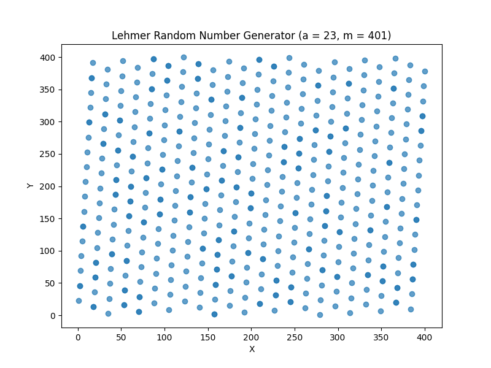

# Random Numbers

A random number is a number generated by a process, whose outcome is unpredictable, and which cannot be subsequentially reliably reproduced.

## Randomness

What does it mean to be random? It is more defined by what it isn't than what it is. Something that is random means that it has a pattern or it is predictable. Well, that's a real problem for a computer because the entire way that we have designed, architected and built computers is for them to be deterministic.

How could we ever get a computer to be random, if it's always supposed to give a certain output for a given input, that we already know about.

Computers use Pseudorandom Number Generators instead.

**Applications:**  
- Cryptography
- Gambling
- Gaming
- Art

Random numbers generated by computers are not random. They are generated based off some algorithm.

# Pseudo-random Number Generators

PRNG stands for "Pseudorandom Number Generator." It is a computer algorithm or process designed to generate a sequence of numbers that appears to be random but is actually determined by a deterministic calculation. In other words, the sequence of numbers generated by a PRNG is not truly random but only exhibits characteristics of randomness, making it suitable for many practical purposes.

PRNGs are widely used in various fields, including computer simulations, cryptography, gaming, and statistical sampling. They are essential in situations where a reliable source of random-like numbers is required but obtaining true randomness is difficult or impractical.

The working principle of a PRNG involves starting with an initial value called a seed, and from that seed, subsequent numbers are generated using a mathematical formula or algorithm. When provided with the same seed, a PRNG will produce the same sequence of numbers every time. This property is useful for reproducibility, as it allows users to recreate the same sequence of "random" numbers when needed.

It's important to note that while PRNGs are sufficient for many applications, they are not suitable for cryptographic purposes or any scenario where high security is required. For cryptographic applications, a different type of random number generator known as a "cryptographically secure PRNG" (CSPRNG) is used, which provides a higher level of unpredictability and security.

**Important properties of good random numbers:**  
- Fast
- Portable to different computers
- Have sufficiently long cycle
- Replicable
- Use identical stream of random numbers for different systems (parallel computing)

## Algorithms

### **Middle Square Method (1946, J. von Neumann)**

- Take any integer (seed) of say a 2-digit number.
- Square it and pick the middle two digits and discard the rest.
- Now again square the selected middle two digits in the previous step.
- Repeat.

---

### **Lehmer Algorithm (1951, D. H. Lehmer)**

- Sometimes also referred to as the Park–Miller random number generator (after Stephen K. Park and Keith W. Miller), is a type of linear congruential generator (LCG) that operates in multiplicative group of integers modulo n. 

$$X_{k+1} = a \cdot X_{k} \mod m$$

where the `modulus m` is a prime number or a power of a prime number, the multiplier a is an element of high multiplicative order modulo `m` (e.g., a primitive root modulo n), and the seed `X``0` is coprime to m.

- Other names are multiplicative linear congruential generator (MLCG) and multiplicative congruential generator (MCG).

**Example:**  

Initial seed (starting point): 7  
Multiplier (a): 5  
Modulus (m): 11  

**Most commonly, the modulus is chosen as a prime number.**

**For the Lehmer RNG, the initial seed X0 must be coprime to the modulus m.**

Formula: seed = (a * seed) % m

seed = (5 * 7) % 11 = 2  
seed = (5 * 2) % 11 = 10  
seed = (5 * 10) % 11 = 6  

Continue this process as many times as needed to generate the sequence of random numbers.

Sequence of random numbers generated using the Lehmer algorithm with these parameters would be: `2, 10, 6, and so on`.

- The Sinclair ZX81 and its successors use the Lehmer RNG with parameters m = 216 + 1 = 65,537 (a Fermat prime F4) and a = 75 (a primitive root modulo F4). 

- The CRAY random number generator RANF is a Lehmer RNG with the power-of-two modulus m = 248 and a = 44,485,709,377,909.

### Problem = Non-randomness of Lehmer's Algorithm:

---

### Linear Congruential Generator (1958, W. E. Thomson and A. Rotenberg)

- It is an algorithm that yields a sequence of pseudo-randomized numbers calculated with a discontinuous picewise linear equation.
- This method represents one of the oldest and best known pseudorandom number generator algorithms.

- The generator is defined by the recurrence relation:
$$X_{k+1} = (a  X_{n} + c) \mod m$$

where, X is the sequence of pseudo-random values, and  
m, 0 < m - the modulus  
a, 0 < a < m - the multiplier  
c, 0 <= c < m - the increment  
X_{0} , 0 <= X_{0} < m - the seed or start value  

are integer constants that specify the generator.

**If c = 0, the generator is often called a Multiplicative Congruential Generator (MCG), or Lehmer RNG.**

**If c ≠ 0, the method is called a Mixed Congruential Generator**

A benefit of LCGs is that an appropriate choice of parameters results in a period which is both known and long. Although not the only criterion, too short a period is a fatal flaw in a pseudorandom number generator.

While LCGs are capable of producing pseudorandom numbers which can pass formal tests for randomness, the quality of the output is extremely sensitive to the choice of the parameters m and a.

For example, a = 1 and c = 1 produces a simple modulo-m counter, which has a long period, but is obviously non-random.

## Randomness test

A randomness test (or test for randomness), in data evaluation, is a test used to analyze the distribution of a set of data to see whether it can be described as random (patternless).

There are many practical measures of randomness for a binary sequence. These include measures based on statistical tests, transforms, and complexity or a mixture of these. A well-known and widely used collection of tests was the Diehard Battery of Tests, introduced by Marsaglia; this was extended to the TestU01 suite by L'Ecuyer and Simard. The use of Hadamard transform to measure randomness was proposed by S. Kak and developed further by Phillips, Yuen, Hopkins, Beth and Dai, Mund, and Marsaglia and Zaman.

Several of these tests, which are of linear complexity, provide spectral measures of randomness.

## Period Length

Historically, poor choices for `a` have led to ineffective implementations of LCGs. A particularly illustrative example of this is RANDU, which was widely used in the early 1970s and led to many results which are currently being questioned because of the use of this poor LCG.

There are three common families of parameter choice:
- m prime, c=0

This is the original Lehmer RNG construction. The period is m−1 if the multiplier a is chosen to be a primitive element of the integers modulo m. The initial state must be chosen between 1 and m−1.

One disadvantage of a prime modulus is that the modular reduction requires a double-width product and an explicit reduction step.

A second disadvantage is that it is awkward to convert the value 1 ≤ x < m to uniform random bits. If a prime just less than a power of 2 is used, sometimes the missing values are simply ignored.

- m a power of 2, c=0

Choosing m to be a power of 2, most often m = 2^32 or m = 2^64, produces a particularly efficient LCG, because this allows the modulus operation to be computed by simply truncating the binary representation. In fact, the most significant bits are usually not computed at all. There are, however, disadvantages.

This form has maximal period m/4, achieved if a ≡ 3 or a ≡ 5 (mod 8). The initial state X0 must be odd, and the low three bits of X alternate between two states and are not useful. It can be shown that this form is equivalent to a generator with a modulus a quarter the size and c ≠ 0.

A more serious issue with the use of a power-of-two modulus is that the low bits have a shorter period than the high bits. The lowest-order bit of X never changes (X is always odd), and the next two bits alternate between two states. (If a ≡ 5 (mod 8), then bit 1 never changes and bit 2 alternates. If a ≡ 3 (mod 8), then bit 2 never changes and bit 1 alternates.)

- c ≠ 0

When c ≠ 0, correctly chosen parameters allow a period equal to m, for all seed values. This will occur if and only if:

    - m and c are relatively prime
    - a-1 is divisible by all prime factors of m
    - a-1 is divisible by 4 if m is divisible by 4

This form may be used with any m, but only works well for m with many repeated prime factors, such as a power of 2

## LCGs in common use
- C++11's minstd_rand	m=2^31 − 1,	a=48271, c=0
- ANSI C m=2^31, a=1103515245, c=12345, output bits of seed in rand() = bits 30...16

## References
- https://en.wikipedia.org/wiki/Middle-square_method
- https://en.wikipedia.org/wiki/Lehmer_random_number_generator
- https://en.wikipedia.org/wiki/Linear_congruential_generator